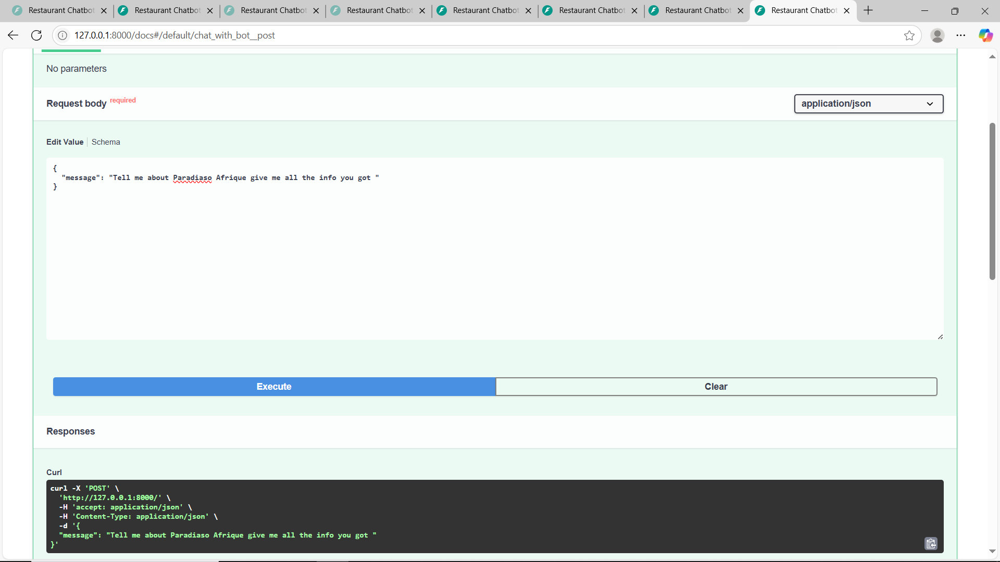
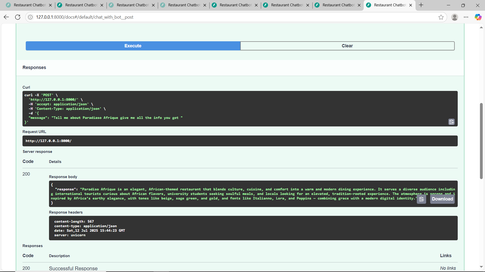

# Paradiso Afrique 👨‍🍳

A modern, responsive restaurant website built with React and Tailwind CSS and is aimed to deliver delicious dishes to its customers to make them satisfied.

## 🚀 Project Overview

Paradiso Afrique is a beautifully designed web application for a luxury restaurant, showcasing its menu, ambiance, and signature dishes and also has an integrated chatbot.

## 🚀 Project Teammates

LilyJoy - UI/UX designer
Ashbel King'ori - Full stack dev
Mahder Hawaz - Full stack dev
Ermias Molla - Gen ai
Meryln Omagwa - Gen ai

## 💻 Technologies used

React Js
Tailwindcss
JavaScript

## 📸 Screenshots

../assets/screenshot-1.png
../assets/screenshot-2.png

## 🛠️ Setup Instructions

   git clone https://github.com/ashbel747/module-2-assessment.git
   cd paradiso-afrique

## 💻 Livesite
https://practicedeplo.netlify.app/

